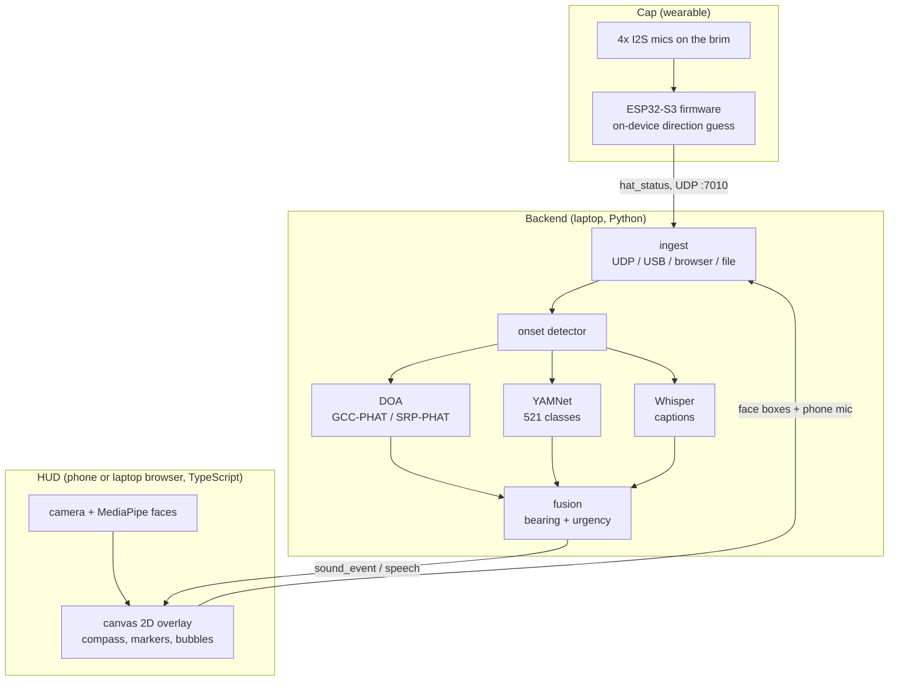

<picture>
  <source media="(prefers-color-scheme: dark)" srcset="web/public/chud-logo-dark.svg">
  
</picture>

# C-HUD Vision

**A cap that shows you where a sound came from.** Four microphones on the brim, a laptop backend that
localizes and classifies what it hears, and a **phone HUD** — live camera plus a canvas overlay — that marks
the direction, names the class, and anchors live captions to the face that spoke.

Built at **HackGT 26** (`hackgt-26`) for d/Deaf and hard-of-hearing wearers. Phone transcription apps give you
the words but not the *who* or the *where*: they listen from a hand-held microphone and show an unattributed
wall of text. C-HUD puts the array on the wearer's head, so a bearing means "to my left", and reuses the phone
already in their pocket as the screen — no headset, no extra hardware to buy.

## What it does

| Feature | Status | Where it lives |
|---|---|---|
| **Coarse direction from the hat** — 4 mics (left/right/front/back), on-device loudest-imbalance heuristic, gated by an `active` flag so the mics' own noise floor does not chase noise | shipped on hardware | `esp32/hackgt_hat/hackgt_hat.ino`, `esp32/README.md` |
| **Sound classification** — YAMNet (521 AudioSet classes) over a 0.975 s window, per-event confidence | shipped, measured | `server/classify.py`, `docs/backend-evidence.md` |
| **Live captions** — faster-whisper on a worker thread, one `speech` message per utterance, linked to its parent event by `parent_event` | shipped, measured | `server/asr.py` |
| **Bearing from the array** — GCC-PHAT per pair, SRP-PHAT when 3+ mics are live, `accuracy_deg` from the measured delay spread instead of a made-up confidence | implemented, selftest-verified; needs a real baseline to run live | `server/doa.py`, `server/selftest.py` |
| **Camera HUD** — bearing compass, per-event markers, class + confidence + urgency labels, edge chevrons when the bearing is off-camera, `ambiguous` events drawn as two mirrored candidates | shipped | `web/src/render.ts`, `web/src/calib.ts` |
| **Captions anchored to faces** — MediaPipe face landmarks + mouth activity, bubbles pinned to the speaker; a loudspeaker gets a marker with **no** face anchor | shipped, with a caveat in the evidence file | `web/src/faces.ts`, `web/dev/evidence.md` |
| **Urgency tiers** — `urgent` displaces everything else; `all` / `important` / `quiet` volume control, enforced on both ends | shipped | `server/urgency.py`, `web/src/state.ts` |
| **Phone as the sensor** — the HUD streams its own microphone to the backend, so the phone can be the array when the laptop's mics are the weak part | shipped | `web/src/mic.ts`, `server/main.py` |
| **Direction on an LED strip** — the screen-free output, the piece that makes this a wearable | not built | design kept in `docs/SPEC.md` §4.4, §7.1 |

## Tech stack



| Layer | Stack |
|---|---|
| Hat | ESP32-S3, Arduino IDE sketch (ESP-IDF 3.x `driver/i2s_std.h`), 4x Adafruit ICS-43434 I2S mics on 2 sample-locked buses, UDP broadcast + USB-CDC serial |
| Backend | Python 3.11+, NumPy/SciPy (GCC-PHAT, SRP-PHAT, delay-and-sum beamforming), `ai-edge-litert` TFLite runtime, faster-whisper, FastAPI + uvicorn, `websockets`, `pyserial` |
| HUD | TypeScript + Vite, canvas 2D (no three.js/WebXR), `@mediapipe/tasks-vision`, WebSocket with reconnect/backoff, self-signed TLS dev server for phone camera access |
| Transport | UDP (hat to backend), WebSocket (backend to HUD), HTTPS/WSS for phone camera — no cloud service in the loop |

## Measured, not asserted

Every number below was produced by a script in this repo, on this checkout. Raw logs: `docs/backend-evidence.md`
and `web/dev/evidence.md`.

| What | Result | How to reproduce |
|---|---|---|
| Onset to client latency | **p50 378 ms** (backend emit p50 378 ms, emit to client p50 2.3 ms, ping RTT p50 1.3 ms) | `tools/run_backend.sh` + `.venv/bin/python tools/latency_bench.py --inject-side flip` |
| YAMNet inference | **5.65 ms** mean per 0.975 s window, warm, XNNPACK CPU | `python -m server.classify` |
| Classifier sanity | sine → `Sine wave` 0.996 · white noise → `Static` 0.738 · pink noise → `Noise` 0.918 · real speech 0.968–0.984 | `python -m server.classify` |
| DOA on synthetic audio at −60/−30/0/+30/+60° | laptop mic pair **±1.7°**, synthetic 240 mm hat geometry via SRP **±6.0°** | `python -m server.selftest --only doa` |
| Packet path | 150/150 packets, 50.0 pps/ch, 0 sequence gaps, per-channel RMS round-trips | `python tools/udp_sniff.py --selftest` |
| Live sign-flip (left vs right delays) | **cannot pass on the dev laptop**: its two DMIC capsules have no inter-channel baseline (< ~5 mm, three independent methods). The coherence gate correctly refuses to report an angle rather than invent one. This is the one test that needs the real hat | `tools/latency_bench.py --inject-side flip` on the hat array |

Honesty rules the pipeline enforces, because a wearable that lies about direction is worse than one that
stays quiet:

- **`accuracy_deg` is mandatory** and comes from the measured spread; the HUD fades a marker by it.
- **A line array is front/back ambiguous.** `ambiguous: true` is emitted on every 1-D result and the HUD draws
  both mirrored candidates — a half-space is never guessed silently.
- **`source: none`** means nothing could localize the sound; the class is still reported, with `accuracy_deg:
  180`, so the marker fades out instead of pointing somewhere false.

## Run it

Three processes, any order (they retry and recover). `tools/run_backend.sh` is the documented backend entry
point and also handles the NixOS loader-path quirk.

```bash
# 1. backend
uv venv .venv && uv pip install -r requirements.txt      # once; models/ is committed
tools/run_backend.sh                                     # defaults: --profile laptop_dmic --source auto

# 2. HUD  (http://localhost:5173 — localhost counts as a secure context, so the camera works)
cd web && npm install                                    # also copies the MediaPipe WASM assets
npm run dev                                              # real backend, or: npm run mock for a scripted feed
npm run phone                                            # phone with camera: prints https://<lan-ip>:5173/

# 3. hat  (Arduino IDE, ESP32-S3 board package 3.x — not PlatformIO, not extra libraries)
#    Open esp32/hackgt_hat/hackgt_hat.ino, set WIFI_SSID/WIFI_PASS to a phone hotspot, flash, watch 115200 baud
```

| Situation | Command |
|---|---|
| HUD's own microphone is the sensor (default demo path) | `tools/run_backend.sh --profile browser_mono --source browser` |
| This laptop's mic pair as a stand-in array (no inter-channel baseline) | `tools/run_backend.sh --profile laptop_dmic --source pw` |
| Auto-detect: listen for raw-audio packets on UDP :7000, fall back to the local mic | `tools/run_backend.sh --source auto` |
| Raw-audio packets (the §4.2 TDOA transport — the current hat firmware sends `hat_status` instead) | `tools/run_backend.sh --source udp` |
| Replay a recording at real time | `tools/run_backend.sh --source file --source-file x.wav` |
| No HUD, no microphone — one line per event in the terminal | `tools/run_backend.sh --no-asr --print-events` |
| Verify the whole DSP path with no hardware | `.venv/bin/python -m server.selftest` |
| Package the HUD | `cd web && npm run build && npm run preview` |

- **Everything must be on the same network.** The hat broadcasts to its own subnet, so use a **phone hotspot**,
  not venue WiFi (client isolation and captive portals both look like "the hat is broken").
- **The phone needs HTTPS for camera and mic.** `npm run phone` prints a URL and a CA; install that CA on the
  phone **once**, or the browser treats the origin as insecure and blocks both APIs. iOS Safari has no WebXR —
  demo on Android Chrome or a laptop.
- The HUD's top-right chip is the diagnostics readout (model path + SHA, git rev, transport, per-mic health,
  calibration, fps, ping-echo latency, face-tracking state). Tap it when nothing shows up.

## Repo layout

| Path | What |
|---|---|
| `esp32/` | Hat firmware (Arduino sketch), wiring table, hotspot/serial notes |
| `server/` | Ingest, detect, DOA, classification, ASR, vision fusion, urgency, WebSocket service, selftest |
| `web/` | Vite + TypeScript HUD: camera, faces, canvas overlay, WS client, phone TLS dev server |
| `config/` | `array.json` (geometry), `calib.json` (measured-constant template — the numbers land when the array is calibrated on the bench) |
| `models/` | YAMNet `.tflite` + class map, committed — both documented fetch URLs are dead |
| `tools/` | `run_backend.sh`, `latency_bench.py`, `udp_sniff.py`, `clap_lab.py`, `speech_watch.py` |
| `docs/` | Backend evidence log, and `SPEC.md`: the original build spec |
| `prompts/` | Paste-ready agent briefs, one per workstream |

## The wire contract

The HUD consumes one WebSocket, `ws://127.0.0.1:8000/ws`. Messages carry `type` and `t` (monotonic seconds):
`sound_event`, `speech`, `presence`, `array_status`, `backend_status`, `timeline` (backend to HUD) plus
`hat_status` (the hat's own broadcast, relayed verbatim); the HUD sends `set_mode`, `ping`, and the additive
`vision` / `audio` frames that let the browser be the camera and the microphone.

**The full field-by-field contract is frozen in [`docs/SPEC.md`](docs/SPEC.md) §4** — angle convention,
packet layout, JSON shapes, `config/array.json`. Section numbers are unchanged from when that file was this
README, so existing `§4.5`-style references still resolve there. Change the contract only alongside the code
in the same commit, and say so in the commit message.

## Limits, and what is next

- The hat reports a **coarse direction guess** from per-mic loudness, not TDOA. The TDOA/SRP path in
  `server/doa.py` is implemented and selftest-verified but needs a real ≥60 mm baseline to run live.
- **No LED strip, no PIR, no sonar** yet — those are wired in the design (`docs/SPEC.md` §7.1), not on the hat.
- Person-vs-playback is a **heuristic** (face + mouth activity); the evidence file states exactly which half of
  it is proven and which is a fallback.
- Next: a printed/milled mic bar with a measured baseline, the WS2812 strip on the brim for screen-free
  direction, elevation from a crown mic, and an accuracy curve across −90…+90° that replaces the synthetic
  numbers above with measured ones.

## References

- SoundWatch (ASSETS 2020) — smartwatch sound classification; its **overload/filtering** finding shapes our
  urgency tiers: https://makeabilitylab.cs.washington.edu/project/soundwatch/
- HoloSound (ASSETS 2020) — AR HMD sound ID for DHH users: https://makeabilitylab.cs.washington.edu/project/holosound/
- HMD sound visualizations (CHI 2015): https://dl.acm.org/doi/abs/10.1145/2702123.2702393
- Adafruit ICS-43434 breakout (PID 6049) pinout, `SEL`, bottom-ported, 1.6–3.6 V:
  https://learn.adafruit.com/adafruit-i2s-mems-microphone-breakout/pinouts
- Prior projects we extend: **HearLink** (4 I2S mics, 2 buses, ESP32-S3, necklace)
  https://devpost.com/software/hearlink · **echoBelt** https://devpost.com/software/echobelt · **WhisperMap**
  https://devpost.com/software/whispermap · **N1 AR glasses**
  https://devpost.com/software/n1-augmented-relaity-sound-awareness-glasses · **Low-latency Sound
  Disambiguator** https://devpost.com/software/low-latency-sound-disambiguator
- YAMNet TFLite: https://tfhub.dev/google/lite-model/yamnet/classification/tflite/1
- Wordmark outlines: Space Grotesk (SIL OFL 1.1); HUD type: Pixelify Sans (SIL OFL 1.1).

<details>
<summary>Repo process docs (build spec, checklist, plan, traps)</summary>

`docs/SPEC.md` is the original build spec and is still the source of truth for the frozen interface shapes,
the parts list, the calibration procedure, and the traps list. Section numbers are unchanged:

| § | Content |
|---|---|
| §0 | Progress checklist (evidence rules: a box is ticked only after its command was run) |
| §1 | Why this is not the 42nd sound-awareness project, and what we extend |
| §2–3 | Constraints, architecture, latency budget, frame-of-reference caveat |
| §4 | **Frozen interfaces** — angle convention, packet layout, WebSocket JSON, `array.json` |
| §5–6 | Ownership, workstream briefs (also in `prompts/`), how to run each half |
| §7–8 | Hat build, calibration, model setup, platform hazards |
| §9–12 | Time plan, demo script, references, traps ranked by time cost |

</details>
